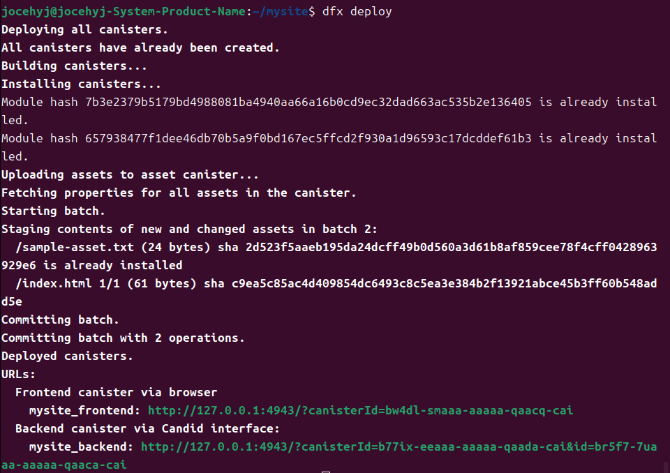
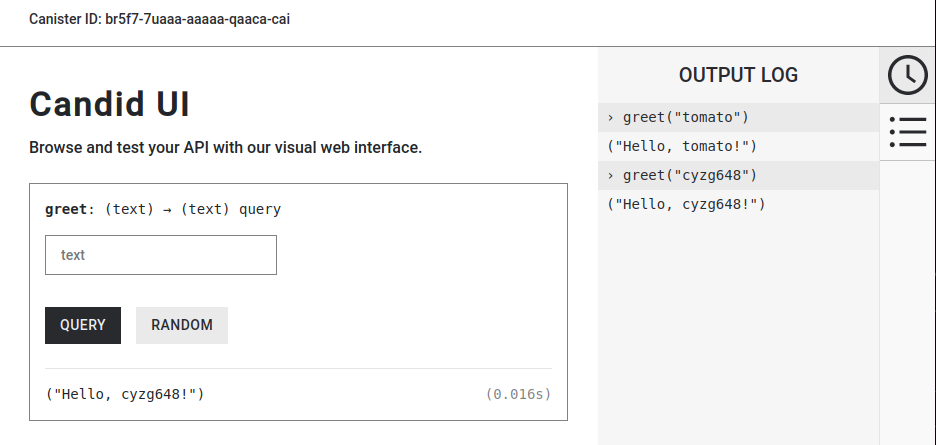
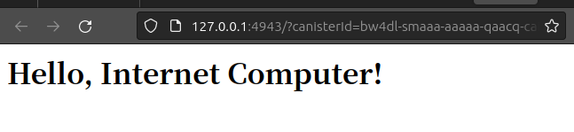

# 第一讲 作业1
## 安装并使用 SDK 在本机搭建一个简易网站 。（2 分，请提交源代码+截屏）

### 源代码
#### mysite_backend
`main.mo`
```Motoko
actor {
  public query func greet(name : Text) : async Text {
    return "Hello, " # name # "!";
  };
};
```

#### mysite_backend
```html
<html>
<body>
<h1>
  Hello, Internet Computer!
</h1>
</body>
</html>
```

### 截图
#### deploy


#### backend
`Candid UI`


#### frontend

