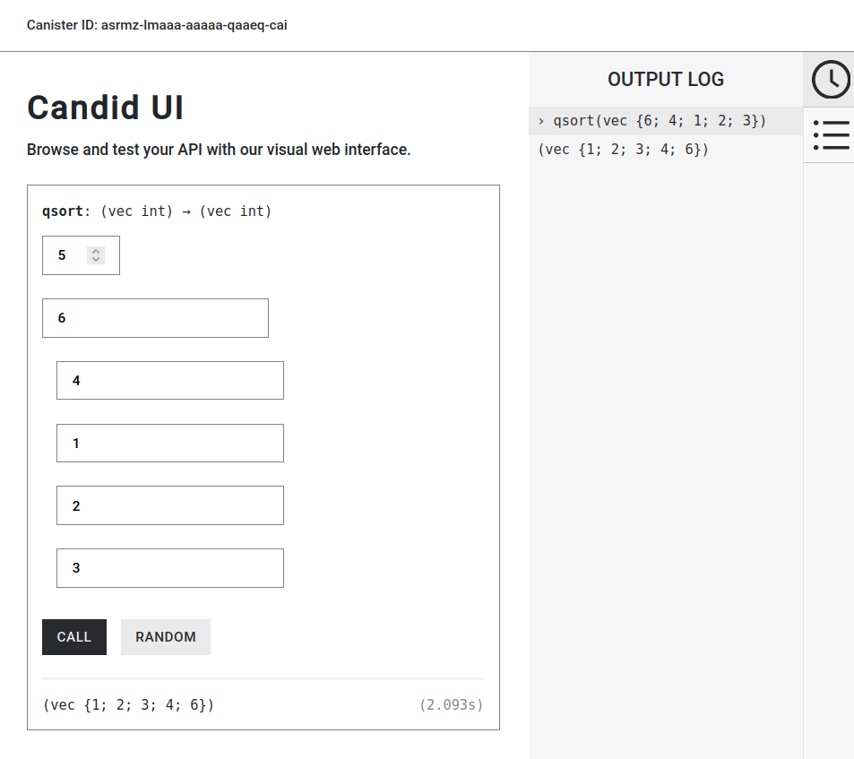

# 第二讲 作业1
## 实现快排函数（顺序从小到大）`quicksort : [var Int] -> () `（5 分）

## 代码
`main.mo`
```Motoko
import Array "mo:base/Array";
import Int "mo:base/Int";
import Nat "mo:base/Nat";

actor {

  public func qsort(arr: [Int]) : async [Int] {
    var newArr:[var Int] = Array.thaw(arr);
    quicksort(newArr, 0, newArr.size()-1);
    Array.freeze(newArr)
  };

  func quicksort(arr:[var Int],low:Nat,high:Nat){
    if(low>=high) return;
    var temp = arr[low];
    var left = low;
    var right = high;
    while(left < right){
      while(arr[right] >= temp and right > left){
        right -= 1;
      };
      arr[left] := arr[right]; // swap 1/3
      while(arr[left] <= temp and left < right){
        left += 1;
      };
      arr[right] := arr[left]; // swap 2/3
    };
    arr[right] := temp; // swap 3/3
    if(left >= 1) // check point 2/2
      quicksort(arr,low,left-1);
    quicksort(arr,left+1,high);
    };
  };
```

## 运行结果

